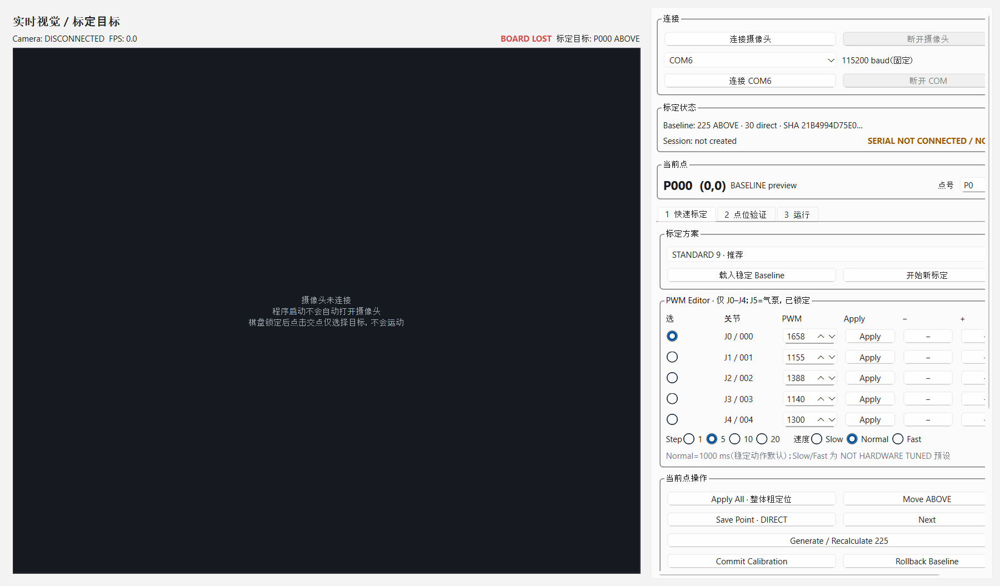

# Calibration Lite — Repository Audit and Implementation Plan

Date: 2026-08-25  
Scope: existing `J1_Gomoku_Integrated` working tree  
Evidence labels: `HARDWARE VERIFIED`, `OFFLINE VERIFIED`, `NOT VERIFIED`

## Audit boundary

This audit was completed before implementing Calibration Lite. It preserves the dirty working tree and treats these files as frozen stable assets:

- `calibration/stage5_board_calibration.json`
- `config/arm_actions.json`

No camera or serial port was opened by the audit capture. No motion command was sent.

## Current product-flow evidence



### Step 1 — launch and find the next action: needs simplification

The current screen is functional but presents camera, connection, calibration status, point metadata, mode selection, five PWM rows, per-row Apply controls, Apply All, Move ABOVE, Save, Next, Generate, Commit and Rollback at once. The user must understand the internal calibration model before taking the first step.

Visible UX issues:

1. The primary action is not visually dominant; connection, baseline loading, session creation and movement compete at the same level.
2. The camera consumes most of the window even when disconnected and is not necessary for every calibration step.
3. The right column requires scrolling and exposes implementation terms such as Baseline, DIRECT, PWM, Apply and Recalculate.
4. A 5/9-anchor guided flow exists in the backend, but the UI still asks the user to choose and sequence each operation manually.
5. The mixed Chinese/English labels and compact control density increase reading effort.
6. Keyboard focus order, screen-reader names and contrast still require runtime accessibility testing; screenshots alone cannot prove compliance.

## Current Architecture

| Capability | Current implementation | Current status |
|---|---|---|
| GUI entry | `app/main.py` → `app.main_window.MainWindow` | Existing entry; no independent Lite entry |
| Main window | `app/main_window.py` | Owns runtime orchestration and wires all Qt signals |
| Current operator panel | `app/gui/control_panel.py`, `app/gui/rapid_calibration_panel.py` | Dense calibration-first panel; legacy Stage 5/6 widgets are instantiated but hidden |
| Serial / STM32 | `app/arm/controller.py::SerialArmController` | Single serial owner; explicit connect; 115200 baud |
| PWM control | `send_joint_pwm`, `send_spatial_pose`, `ActionLibrary` | J0–J4 live adjustment with protocol and teaching-envelope checks; J5 pump protected |
| Motion worker | `app/arm/worker.py::ArmSequenceWorker` | Single queued sequence, interruptible waits, concurrency rejection |
| Arm state | `app/arm/state.py::ArmStateMachine` | Connection, observe, pick, place, hover, error and ESTOP guards |
| Stable actions | `config/arm_actions.json`, `app/arm/actions.py` | 11 stable named actions; frozen without revalidation |
| Pick / place | `app/arm/sequences.py` | Existing guarded pick, P77 place and full-cycle sequences |
| ABOVE planning | `app/stage5/hover_planner.py` | Existing carry-high → target ABOVE and guarded return |
| Anchor storage | `app/stage5/calibration_store.py` | Stable 30-anchor baseline and atomic persistence |
| 225-point interpolation | `app/stage5/pwm_interpolator.py`; Stage 7 delta field in `app/stage7/session.py` | Existing bilinear interpolation reused by Stage 7 |
| Rapid calibration service | `app/stage7/coordinator.py::RapidCalibrationCoordinator` | New/load session, anchor save, recalculate, verify, commit, rollback, live jog |
| Rapid calibration data | `calibration/sessions/`, `config/stage7_rapid_calibration.json` | Separate from stable Stage 5 baseline |
| Camera | `app/vision/camera_worker.py` | Explicit open; frame worker and relocalization |
| Board detection | `app/vision/board_tracker.py`, `app/vision/localization/` | Tag 15–18 board lock/freeze/lost flow |
| Robot Reference | No detector/service exists | `NOT VERIFIED`; status can be reserved but must not claim Found |
| Safety | controller guards, sequence validation, main/Stage 5 ESTOP latches, pump-off | Physical cutoff remains final safety control |
| Tests | `tests/test_stage5_*`, `test_stage6_*`, `test_stage7_*`, arm/vision tests | 177 passed; 2 pre-existing stale assertions at audit |

### Existing data truth

- Stable Stage 5 source: 30 direct anchors and 195 runtime-interpolated points, 225 resolved total. `HARDWARE VERIFIED` only for the previously exercised Stage 5 anchors/path; not every interpolated point.
- Stage 7 QUICK 5 coordinates already match the requested sparse layout: `(0,0)`, `(0,14)`, `(7,7)`, `(14,0)`, `(14,14)`.
- Stage 7 internal flat IDs are `P000`, `P014`, `P112`, `P210`, `P224`. The Lite UI will display human board labels `P00`, `P014`, `P77`, `P140`, `P1414` and always retain row/column metadata internally.
- Pick has no success sensor. The UI may say “Pick sequence completed”; it must not say sensor-confirmed success.
- Stable placement is fixed P77 only. Arbitrary-board placement is not available and will not be invented in this GUI refactor.

## Reuse Plan

Calibration Lite will call existing APIs rather than duplicate robot behavior:

| Lite responsibility | Reused API |
|---|---|
| Connect STM32 | `MainWindow.connect_serial` → `SerialArmController.connect` |
| Connect camera | `MainWindow.connect_camera` → `CameraWorker` |
| Return to safe start | `MainWindow.start_return_to_observe` |
| Start QUICK 5 | `RapidCalibrationCoordinator.new_session(QUICK_5)` |
| Resolve current PWM | `RapidCalibrationCoordinator.point_pwm` |
| Move to ABOVE | existing Stage 5 hover planner through `MainWindow.stage7_move_above` |
| Fine adjustment | `stage7_apply_joint` / coalesced live jog queue |
| Safety clamp | `derive_calibration_limits` plus controller 500–2500 guard |
| Save an anchor | `RapidCalibrationCoordinator.save_anchor` |
| Generate 225 points | `RapidCalibrationCoordinator.recalculate` |
| Verify a test point | `RapidCalibrationCoordinator.verify` |
| Commit deployment | `RapidCalibrationCoordinator.commit` |
| Test pick | `MainWindow.start_pick` → existing `pick_piece` sequence |
| Test fixed P77 place | `MainWindow.start_place` → existing `place_to_p77` sequence |
| Stop / pump off / recover | existing MainWindow safety methods and both ESTOP latches |
| Show legacy tools | existing `MainWindow`, `ControlPanel`, Stage 5/6 and diagnostic widgets |

## Calibration Lite Implementation Plan

### 1. Independent entry

Add `python -m app.calibration_lite.main` and a root `calibration_lite.py` convenience entry. Keep `python -m app.main` as the legacy application.

### 2. Lite application shell

Build a compact professional-device home screen with:

- STM32, Camera, Robot Reference and Board status rows;
- last calibration date, anchor count, generated count and validity;
- one dominant `快速标定` button;
- `测试取料` and fixed `测试落子 P77` actions;
- always-visible ESTOP and pump-off controls;
- one `Advanced / Legacy` disclosure.

### 3. QUICK 5 wizard

Use a stateful wizard that owns the next-step decision:

```text
safe start
→ P00
→ P014
→ P77
→ P140
→ P1414
→ save and generate 225
→ quick test the same five points
→ commit
→ READY
```

The page shows one point only, `Step n / 5`, current target, one primary movement action and one confirmation action. Confirming an anchor automatically saves it and advances to the next anchor.

### 4. Adjustment controls

The stable project has no hardware-verified Cartesian millimetre jog API. Calibration Lite therefore will not fake `0.5 mm / 1 mm / 5 mm` or pretend that one servo equals Z motion.

The first implementation will:

- keep the main wizard focused on the current point and next action;
- put direct J0–J4 PWM editing behind `Advanced PWM`;
- support keyboard input, explicit Move/Enter, `−10`, `−1`, `+1`, `+10`, current/target display, safety clamps and Undo Last Adjustment;
- show J5 as locked pump state instead of exposing arbitrary pump PWM.

This is a deliberate safety adaptation, not a missing UI feature.

### 5. Automatic persistence

Per-point confirmation saves the DIRECT anchor atomically. After anchor 5, one `保存并生成全盘` action runs existing recalculation, validates 225 records, saves the session and presents a short result. Commit remains a separate final confirmation because it changes the active Stage 7 deployment.

### 6. Quick Test and local correction

Test the five key points one at a time. `不准确` returns directly to the same point adjustment screen. After correction, the service saves the local anchor and recalculates the board. Add Anchor will accept a single row/column target without exposing the full 225-point grid.

### 7. Reference status

Use configuration-owned `robot_tag_ids` and existing board tag IDs. Robot Reference remains gray `Not configured / Not found` until a real detector exists; it does not block the Lite GUI refactor. Board status continues to use the existing BoardTracker.

### 8. Legacy preservation

The existing application remains startable. Calibration Lite exposes it through `Advanced / Legacy` without copying its serial, calibration or motion logic.

### 9. Verification

- OFFLINE: wizard state transitions, anchor order, automatic save/generate, last-context recovery, PWM clamps/undo, pick/place intent routing and ESTOP blocking.
- Visual: home, point adjustment, generated result, quick test and completion screenshots.
- Legacy: `python -m app.main --smoke-test` still starts and closes.
- Hardware: no new Lite motion is claimed `HARDWARE VERIFIED` until separately exercised by the operator.

## Acceptance mapping

| Requested outcome | Planned proof |
|---|---|
| No need to choose the next step | Wizard owns anchor/test order and primary action text |
| No 225-point wall | Lite never renders the 15×15 grid |
| No console/log wall | Logs remain in Legacy/Advanced |
| Sparse anchors | QUICK 5 plus optional one-point Add Anchor |
| One save/generate action | Single wizard completion action orchestrates existing service calls |
| Pick without fake feedback | Completion message explicitly says sequence-completed, not sensor-confirmed |
| Place without new motion stack | Fixed P77 only through the existing stable sequence |
| Resume months later | Home summary reads the current deployment or latest session |
| Legacy remains available | Original entry and Advanced/Legacy launch path remain |
